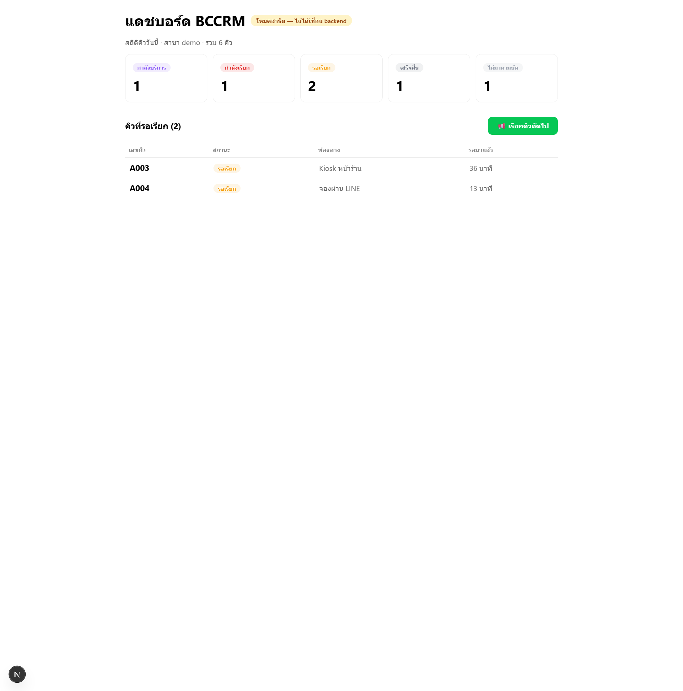
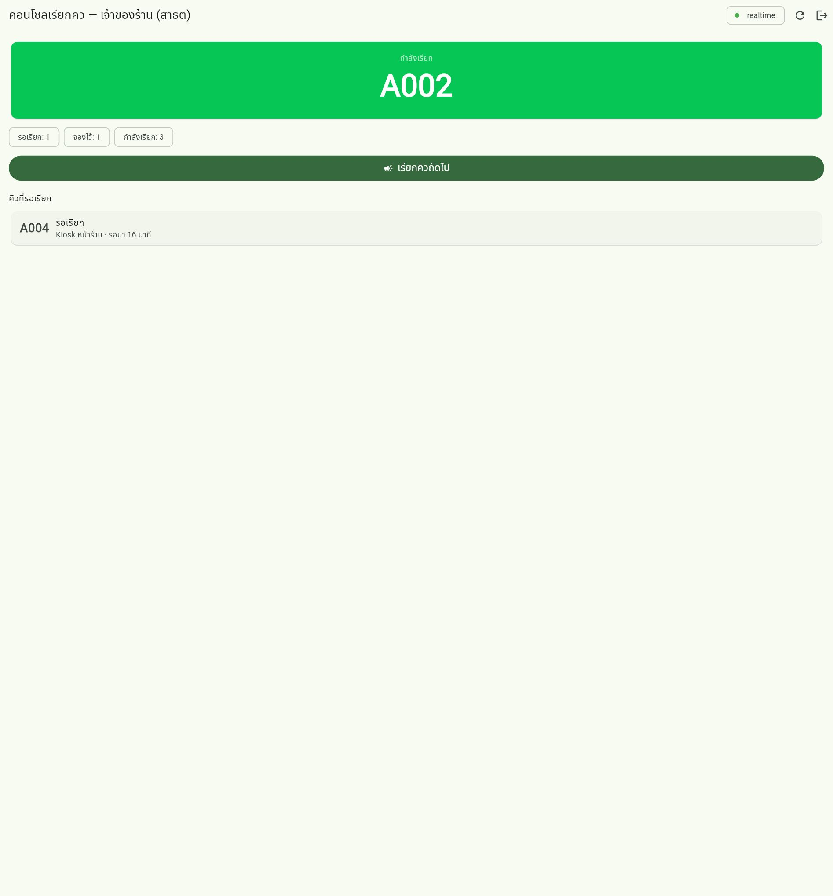

# BCCRM — ระบบ CRM + คิว สำหรับธุรกิจไทย 🇹🇭

<p>
  <a href="LICENSE"></a>
  
  
  
  
</p>

ระบบบริหารคิวและลูกค้าสัมพันธ์ (CRM) แบบโอเพนซอร์สสำหรับธุรกิจบริการไทย — คลินิก, ร้านทำผม, ร้านอาหาร, ศูนย์บริการ, ธนาคารย่อย

ลูกค้า **จองคิว เช็กคิว และรับแจ้งเตือนผ่าน LINE OA** โดยไม่ต้องโหลดแอปเพิ่ม ส่วนร้านค้าใช้ **Web Admin + แอปมือถือ (Flutter) + Kiosk หน้าร้าน + จอแสดงคิว** ครบในที่เดียว

> **License: MIT — ใช้ฟรี ดัดแปลงได้ ทำการค้าได้ ไม่มีเงื่อนไขซ่อน**

---

## 📸 หน้าจอจริง

| Web Admin (Next.js) | แอปพนักงาน (Flutter) |
|---|---|
|  |  |

## 🏗️ สถาปัตยกรรม

```
ลูกค้า (LINE OA + LIFF) ──► Backend API (NestJS) ◄── Kiosk หน้าร้าน (แท็บเล็ต Android/iPad)
                                     │
Web Admin (Next.js) ────────────────┤── MongoDB (ข้อมูลหลัก)
                                     │── Redis (cache / pub-sub)
Mobile App (Flutter) ───────────────┤── MinIO (เก็บรูป/ไฟล์)
 เจ้าของร้าน / ผู้จัดการ / พนักงาน   │
AI Agent ──MCP──► POST /mcp ────────┘
```

**ทุก client เชื่อม backend ตัวเดียว** — REST, WebSocket (socket.io) และ MCP (สำหรับ AI agent) อยู่ในโปรเซสเดียวกัน

## 📦 โครงสร้าง Monorepo (pnpm + Turbo)

| Path | คำอธิบาย |
|---|---|
| `apps/api` | Backend API (NestJS) — queue engine, LINE webhook, CRM, Auth, **MCP server** |
| `apps/admin` | Web Admin (Next.js 15) — ตั้งค่าร้าน/สาขา/บริการ, จัดการคิว, รายงาน |
| `apps/liff` | LIFF apps (Vite + React) — จองคิว, บัตรคิวของฉัน, โปรไฟล์สมาชิก |
| `apps/mobile` | แอปมือถือ + Kiosk (Flutter) — login, คอนโซลเรียกคิว realtime, ออกบัตรคิว, จอแสดงคิว |
| `packages/queue-engine` | ตรรกะคิวแกนกลาง (ออกเลข, จัดลำดับ, state machine) — ใช้ซ้ำได้ทุกฝั่ง |
| `packages/line-sdk` | Flex Message templates ภาษาไทย + webhook helpers |
| `packages/database` | Prisma schema (ทางเลือก PostgreSQL — ปัจจุบันใช้ MongoDB เป็นหลัก) |
| `packages/ui` | Shared UI components |

## ✅ สิ่งที่ทำเสร็จแล้ว (ใช้งานได้จริง)

- **Backend API** (NestJS) + MongoDB จริง — seed ข้อมูลสาธิตอัตโนมัติ
- **ระบบคิวครบวงจร** — ออกบัตรคิว (atomic ด้วย `findOneAndUpdate + $inc`, หลายเครื่องออกพร้อมกันเลขไม่ชน), เรียกคิว, ข้าม/ยกเลิก/เสร็จสิ้น, สถิติรายวัน
- **Auth + JWT** — login จริงผ่าน API (บัญชีสาธิตพร้อมใช้)
- **Realtime** — socket.io แจ้งทุกจอในสาขาทันทีเมื่อคิวเปลี่ยน (ห้อง `branch:<branchId>`)
- **MCP Server** — `POST /mcp` พร้อม 5 tools ให้ AI agent สั่งงานคิวได้ (ดูด้านล่าง)
- **แอป Flutter** — login → คอนโซลเรียกคิว realtime, หน้า Kiosk ออกบัตรคิว, หน้าจอแสดงคิว (ทดสอบ end-to-end แล้ว: login → เห็นคิวจริง → เรียกคิว → สถิติอัปเดต)
- **Web Admin** — เชื่อม API จริง + โหมดสาธิตอัตโนมัติเมื่อ API ไม่พร้อม
- **Docker Compose** — mongo + redis + minio + api + admin ขึ้นคำสั่งเดียว

## 🚀 เริ่มใช้งาน (Self-Host)

ความต้องการ: **Node.js ≥ 20, pnpm ≥ 9** (Docker เฉพาะตอนใช้ MongoDB/Redis จริง, Flutter SDK เฉพาะตอนรันแอป)

### ทางลัด: รันเล่นทันที ไม่ต้องมีฐานข้อมูล

```bash
pnpm install
DB_MODE=memory pnpm --filter @bccrm/api dev   # API + MCP ที่พอร์ต 3001 (ข้อมูลตัวอย่างใน RAM)
pnpm --filter @bccrm/admin dev                # Web Admin ที่พอร์ต 3000
```

> บน Windows (cmd): `set DB_MODE=memory && pnpm --filter @bccrm/api dev`

**บัญชีสาธิต: `owner@example.com` / `demo1234`**
สาขา `demo` · บริการ `svc-general` (เลข A), `svc-vip` (เลข V) · เคาน์เตอร์ `counter-1`, `counter-2`

### รันกับ MongoDB จริง (แนะนำ — ข้อมูลไม่หาย)

```bash
docker compose up -d mongo redis minio   # หรือใช้ MongoDB/Redis ที่มีอยู่ แก้ MONGODB_URL ใน .env
cp .env.example .env                     # DB_MODE=mongo เป็นค่าเริ่มต้น
pnpm --filter @bccrm/api dev
```

ระบบ seed บริการตัวอย่างของสาขา `demo` ลง Mongo ให้อัตโนมัติครั้งแรก

### รันเต็มรูปแบบด้วย Docker คำสั่งเดียว

```bash
docker compose up -d   # mongo + redis + minio + api + admin
```

### รันแอปมือถือ (Flutter)

```bash
cd apps/mobile
flutter pub get
flutter run --dart-define=BCCRM_API_URL=http://<IP-เครื่อง-backend>:3001
```

- **Android emulator:** ใช้ `http://10.0.2.2:3001`
- **มือถือจริง:** ใช้ IP เครื่องใน LAN เดียวกัน
- **ลองบน browser:** `flutter run -d web-server --web-port 4400`
- login ด้วยบัญชีสาธิต → หน้าคอนโซลเรียกคิว อัปเดต realtime (chip "realtime" มุมขวาบน)

## 🔌 API & MCP (ทุก client เชื่อมที่เดียว)

| ทางเข้า | URL | ใช้โดย |
|---|---|---|
| REST API | `http://localhost:3001/api/...` | Web Admin, Flutter, Kiosk, LIFF |
| **MCP** | `POST http://localhost:3001/mcp` | AI agent / automation (JSON-RPC, stateless) |
| Realtime | `ws://localhost:3001` (socket.io) | จอ TV, แอปพนักงาน, Kiosk |
| LINE webhook | `POST /webhooks/line` | LINE Platform |

**MCP tools** (wrap ตรรกะคิวตัวเดียวกับ REST ทุกประการ):

| Tool | หน้าที่ |
|---|---|
| `bccrm_list_waiting` | ดูคิวที่รอเรียก |
| `bccrm_create_ticket` | ออกบัตรคิวใหม่ |
| `bccrm_call_next` | เรียกคิวถัดไป |
| `bccrm_change_state` | เปลี่ยนสถานะคิว (เสิร์ฟแล้ว/ข้าม/ยกเลิก) |
| `bccrm_today_stats` | สถิติวันนี้ |

Flutter / AI agent เชื่อม backend ตัวเดียวได้ทั้ง REST และ MCP

## 💬 ตั้งค่า LINE OA

1. สมัคร LINE Official Account + เปิด Messaging API ที่ [LINE Developers](https://developers.line.biz/)
2. สร้าง channel → นำ `Channel ID / Secret / Access Token` ใส่ `.env`
3. ตั้ง Webhook URL ชี้มาที่ `https://<โดเมนของคุณ>/webhooks/line`
4. สร้าง LIFF app 3 ตัว (จองคิว / บัตรคิว / โปรไฟล์) แล้วใส่ LIFF ID ใน `.env`

## ⚙️ ตัวแปรแวดล้อมสำคัญ

| ตัวแปร | ค่าเริ่มต้น | คำอธิบาย |
|---|---|---|
| `DB_MODE` | `mongo` | `mongo` / `memory` / `prisma` |
| `MONGODB_URL` | `mongodb://127.0.0.1:27018/bccrm` | connection string MongoDB |
| `REDIS_URL` | `redis://127.0.0.1:6379` | Redis |
| `PORT` | `3001` | พอร์ต backend |
| `BCCRM_API_URL` | `http://localhost:3001` | (Flutter) ชี้ไป backend |

## 📚 เอกสารเพิ่มเติม

- [แผนออกแบบระบบฉบับเต็ม](PLAN-CRM-LINE-QUEUE.md) — ที่มา การวิเคราะห์คู่แข่ง และ roadmap 3 เฟส
- [วิธีมีส่วนร่วมพัฒนา (CONTRIBUTING)](CONTRIBUTING.md)
- [Prompt สร้างภาพประกอบ](docs/image-prompts.md)

## 🗺️ Roadmap

- **Phase 1 (MVP — กำลังทำ):** คิวจองล่วงหน้า + walk-in ✅, Kiosk ✅, จอแสดงคิว ✅, แจ้งเตือน LINE, LIFF ครบ 3 หน้า
- **Phase 2:** CRM เต็มรูปแบบ, PDPA consent, RBAC แยกสิทธิ์เจ้าของ/ผู้จัดการ/พนักงาน, build iOS, รายงานขั้นสูง
- **Phase 3:** สมาชิก/แต้ม/คูปอง, Smart Queue (คาดการณ์เวลารอ), plugin marketplace

## 🤝 มีส่วนร่วม

ยินดีรับทุก contribution — fork แล้วส่ง PR มาได้เลย หรือดู issues ที่ติดป้าย `good first issue`

สร้างด้วย ❤️ เพื่อร้านค้าไทย
